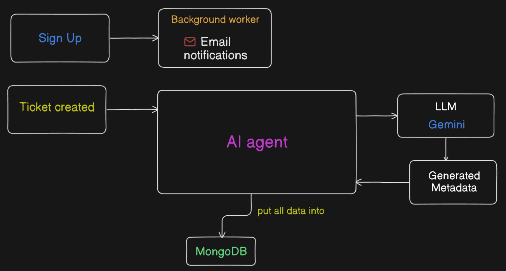

# AI Ticketing System

A smart ticket management system that uses AI to automatically categorize, prioritize, and assign support tickets to the most appropriate moderators.

---

## Tech Stack

- **Backend** → Node with ExpressJS
- **Database** → MongoDB
- **Authentication** → JWT (Json Web Token)
- **Background Jobs** → Inngest
- **Email** → Nodemailer with Mailtrap
- **AI Integration** → Google Gemini API
- **Development** → Nodemon for hot reloading

### The system uses AI (Gemini) to

- Determine required skills
- Categorize the ticket
- Set priority
- Generate helpful notes

### Event-driven architecture (via Inngest)

- AI-powered decision making
- Automated workflows
- Role-based access control
- Email notifications

## High-level Architecture of the application

---

## Features of the Application

- **AI-Powered Ticket Processing**
  - Automatic ticket categorization
  - Smart priority assignment
  - Skill-based moderator selection
  - AI-generated helpful notes for moderator regarding the ticket

- **Smart Moderator Assignment**
  - Automatic matching of tickets to moderators based on skills
  - Fallback to admin assignment if no matching moderator found
  - Skill-based routing system

- **User Management**
  - Role-based access control / RBAC (User, Moderator, Admin)
  - Skill management for moderators
  - User authentication with JWT

- **Background Processing**
  - Even-driven architecture using Inngest
  - Automated email notifications
  - Asynchronous ticket processing

---

## Prerequisite

- Node.js (v18 or higher)
- MongoDB
- Google Gemini API key
- Mailtrap account (for email testing)

---

## Author

- [Soumo Sarkar](https://www.linkedin.com/in/soumo-sarkar/)

## Reference

- [Google AI Studio](https://aistudio.google.com/) for Gemini API Key
- [Mailtrap](https://mailtrap.io) for testing and sending emails during development
- [AgentKit by inngest](https://agentkit.inngest.com/getting-started/quick-start)
